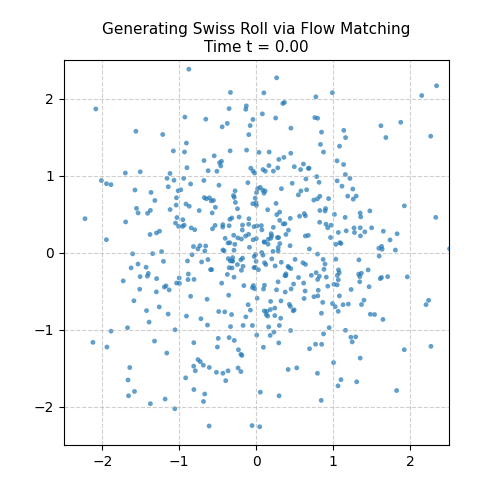

# Latent Space DiT Flow Matching

[](https://www.python.org/)
[](https://pytorch.org/)
[](https://huggingface.co/docs/diffusers/index)
[](https://pytorch.org/vision/stable/index.html)
[](https://scikit-learn.org/)

HackMD Article : https://hackmd.io/@bGCXESmGSgeAArScMaBxLA/rJgvesHfGg

This project implements a high-performance generative modeling framework combining **Latent Space Modeling**, **Diffusion Transformers (DiT)**, and **Optimal Transport Conditional Flow Matching (OT-CFM)**. By learning continuous velocity fields within the latent space of a pre-trained VAE (`stabilityai/sd-vae-ft-ema`), the model establishes straight ODE generation paths from Gaussian noise to data samples. The framework features **Adaptive Layer Normalization (adaLN-Zero)**, **Classifier-Free Guidance (CFG)**, and **Exponential Moving Average (EMA)** for high-fidelity conditional image synthesis.

---

## 📂 Project Structure

```text
.
├── dataset.py                  # CelebA sample face downloader & PyTorch DataLoader with image transforms
├── dit.py                      # Core Diffusion Transformer (DiT) architecture with adaLN modulation & 2D SinCos pos embeds
├── flow_matching.py            # Optimal Transport Flow Matching (OT-CFM) loss & Euler ODE integration step
├── train.py                    # Main training script (VAE latent encoding, DiT training loop with EMA & Cosine Annealing)
├── inference.py                # Inference pipeline with Classifier-Free Guidance (CFG) generating `generation_process.gif`
├── swiss_roll_flow_matching.py # Standalone 2D toy experiment (OT-CFM on Swiss Roll dataset -> `swiss_roll_flow.gif`)
├── dit_celeba10.pt             # Pre-trained DiT checkpoint (containing model state & EMA weights)
├── figure_dit_architecture.svg # Architectural diagram illustrating the Latent DiT Flow Matching pipeline
├── generation_process.gif      # Animation showing the image generation process via Euler ODE integration
└── swiss_roll_flow.gif         # Animation showing continuous flow integration on 2D Swiss Roll distribution
```

---

## 🏗 Architecture & Methodology

### 1. Optimal Transport Continuous Flow Matching (OT-CFM)
Unlike standard diffusion models that rely on curved stochastic trajectories, Optimal Transport Flow Matching defines a straight probability path between Gaussian noise $x_0 \sim \mathcal{N}(0, I)$ and latent data $x_1$:

$$x_t = (1 - t) x_0 + t x_1$$

The target velocity field is constant along the linear trajectory $v_t(x_t) = x_1 - x_0$. The model parameterizes a neural network $v_\theta(x_t, t, y)$ to minimize the mean squared error:

$$\mathcal{L}_{\text{OT-CFM}} = \mathbb{E}_{t \sim U(0,1), x_0, x_1} \left[ \| v_\theta(x_t, t, y) - (x_1 - x_0) \|^2 \right]$$

### 2. Diffusion Transformer (DiT) Backbone
- **Latent Patchification**: $4 \times 32 \times 32$ VAE latents are sliced into $2 \times 2$ patches ($N = 256$ tokens).
- **Conditioning**: Timesteps $t$ and class labels $y$ are injected via adaptive LayerNorm (`adaLN-Zero`), dynamically shifting and scaling attention blocks.
- **Classifier-Free Guidance (CFG)**: During training, class labels are dropped with probability $p_{\text{drop}} = 0.1$. At inference time, velocity predictions are guided via:

$$v_{\text{pred}} = v_{\text{uncond}} + s \cdot (v_{\text{cond}} - v_{\text{uncond}})$$

---

## 🚀 Quick Start

### Installation
Ensure PyTorch and required packages are installed:
```bash
pip install torch torchvision diffusers scikit-learn pillow matplotlib
```

### 1. 2D Toy Flow Matching (Swiss Roll)
Train a 2D velocity network on the Swiss Roll dataset and visualize the ODE vector field generation process:
```bash
python swiss_roll_flow_matching.py
```
*Output*: Generates `swiss_roll_flow.gif`.

### 2. Train Latent DiT Flow Matching
Train DiT on VAE-encoded latents (uses SD-VAE `stabilityai/sd-vae-ft-ema`):
```bash
python train.py
```
*Output*: Saves model weights and EMA state to `dit_celeba10.pt`.

### 3. Inference & GIF Generation
Generate images using Euler ODE integration with Classifier-Free Guidance (CFG scale = 4.0):
```bash
python inference.py
```
*Output*: Saves generation trajectory animation to `generation_process.gif`.

---

## 🎬 Visualizations

| Latent DiT Image Synthesis | 2D Swiss Roll Flow Matching |
| :---: | :---: |
|  |  |
